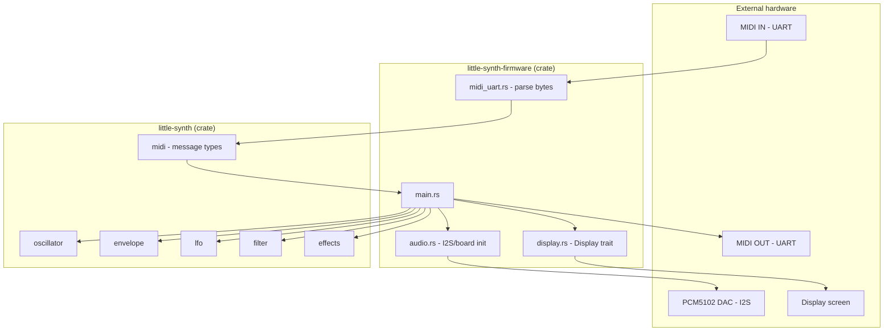
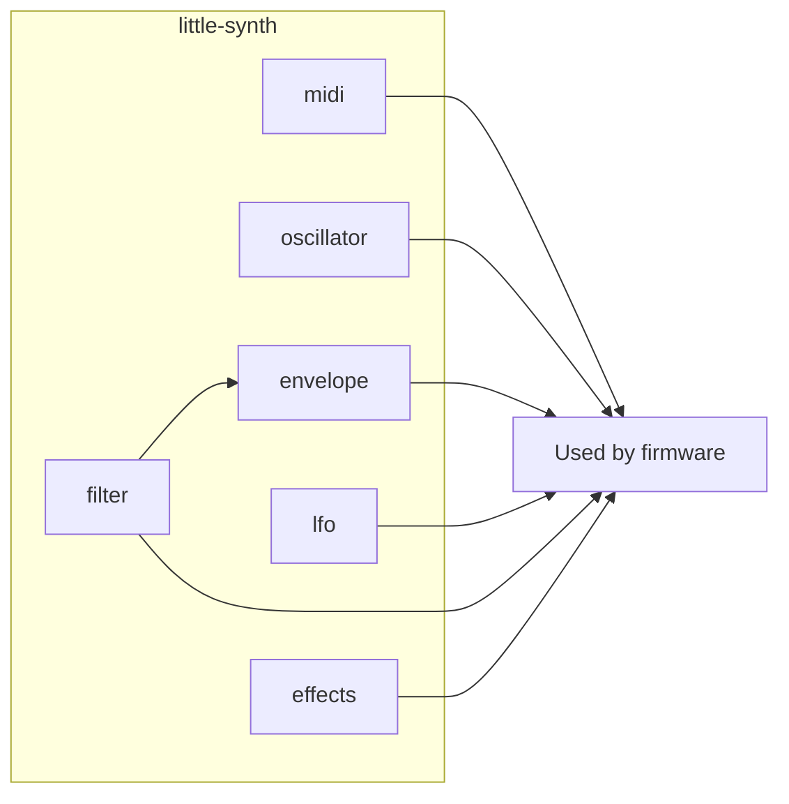
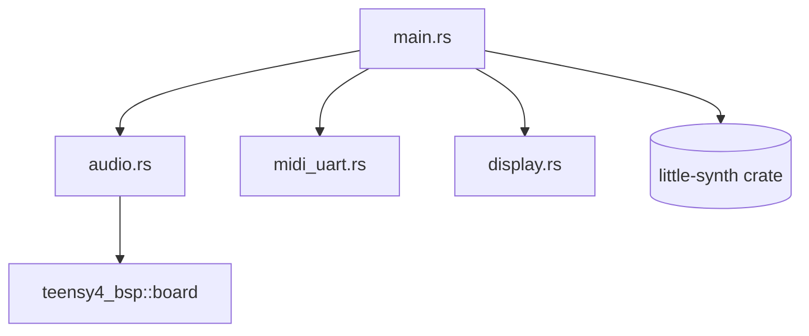
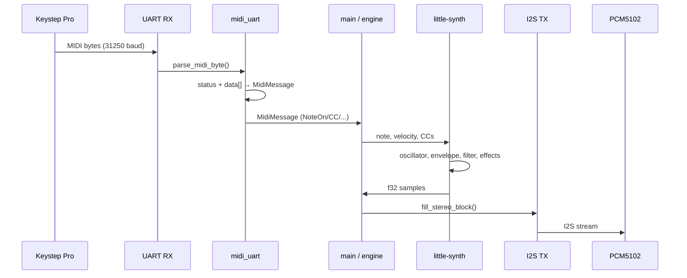

# little-synth — Architecture (Single Source of Truth)

**One-line summary for LLMs:** little-synth is a Rust synthesizer firmware for Teensy 4.1: a `little-synth` (synth) crate holds all DSP (oscillator, envelope, LFO, filter, effects, MIDI types) and is no_std and unit-tested on host; a `little-synth-firmware` (firmware) crate is the no_std binary that uses teensy4-bsp, drives PCM5102 I2S audio out, UART MIDI in/out, and a display trait. MIDI flows in via UART → firmware parses → synth engine → samples out via I2S; the display trait is for a future UI.

---

## Table of contents

1. [High-level overview](#1-high-level-overview)
2. [Crates and boundaries](#2-crates-and-boundaries)
3. [Synth crate (DSP)](#3-synth-crate-dsp)
4. [Firmware crate (hardware)](#4-firmware-crate-hardware)
5. [Data flow](#5-data-flow)
6. [Hardware map](#6-hardware-map)
7. [Glossary and conventions](#7-glossary-and-conventions)
8. [File map](#8-file-map)

---

## 1. High-level overview

```
┌─────────────────────────────────────────────────────────────────────────────┐
│                           little-synth system                                │
├─────────────────────────────────────────────────────────────────────────────┤
│                                                                              │
│   MIDI IN (UART)     ┌──────────────────┐     I2S (BCK,LRCK,DIN)              │
│   ◄──────────────────│    FIRMWARE      │──────────────────►  PCM5102 DAC     │
│                      │  (Teensy 4.1)    │                                    │
│   MIDI OUT (UART)    │                  │     Display (trait)                │
│   ──────────────────►│  - Parse MIDI    │──────────────────►  Screen (future) │
│                      │  - Fill buffers   │                                    │
│                      │  - Drive I2S/UART│                                    │
│                      └────────┬─────────┘                                    │
│                               │ uses                                          │
│                               ▼                                               │
│                      ┌──────────────────┐                                    │
│                      │      SYNTH       │   (no_std, testable on host)        │
│                      │  - Oscillator    │                                    │
│                      │  - Envelope      │                                    │
│                      │  - LFO           │                                    │
│                      │  - Filter        │                                    │
│                      │  - Effects       │                                    │
│                      │  - MIDI types    │                                    │
│                      └──────────────────┘                                    │
│                                                                              │
└─────────────────────────────────────────────────────────────────────────────┘
```



---

## 2. Crates and boundaries

| Crate | Role | Target | Heap | Std |
|-------|------|--------|------|-----|
| **little-synth** | All DSP and MIDI message types. Pure logic, no hardware. | Host (tests) or thumbv7em-none-eabihf (when linked by firmware) | No | No (libm for math) |
| **little-synth-firmware** | Board init, I2S audio out, UART MIDI, display interface. Entry point and hardware glue. | thumbv7em-none-eabihf (Teensy 4.1) | Optional (BSP heap) | No |

**Rule:** Synth crate never touches hardware or platform APIs. Firmware never implements DSP algorithms; it only parses MIDI, calls synth APIs, and moves samples to the DAC.

```
┌─────────────────────────────────────┐     ┌─────────────────────────────────────┐
│           little-synth               │     │       little-synth-firmware           │
│  ─────────────────────────────────  │     │  ─────────────────────────────────   │
│  • Oscillator, envelope, LFO        │     │  • main, panic handler               │
│  • Filter, effects                  │     │  • audio (board init, I2S stubs)    │
│  • MIDI message types & parsing     │     │  • midi_uart (byte → MidiMessage)    │
│  • no_std, libm                     │     │  • display (trait + DummyDisplay)     │
│  • Unit tests in tests/*.rs         │     │  • teensy4-bsp, cortex-m-rt           │
└─────────────────────────────────────┘     └─────────────────────────────────────┘
                    │                                        │
                    └────────── firmware depends on synth ───┘
```

---

## 3. Synth crate (DSP)

**Path:** `crates/synth/`  
**Public modules:** `envelope`, `lfo`, `midi`, `oscillator`, `effects`, `filter`.

### 3.1 Module diagram



### 3.2 Module summary

| Module | Purpose | Key types |
|--------|---------|-----------|
| **midi** | MIDI message representation and parsing from bytes. | `MidiMessage`, `from_bytes([u8;3])`, `data_bytes(status)` |
| **oscillator** | Wavetable + additive harmonics. Single-phase, tick(freq) → sample. | `Oscillator`, `WAVETABLE_LEN`, `set_harmonics()` |
| **envelope** | ADSR envelope. Trigger/release, advance(dt) → level. | `AdsrEnvelope`, `AdsrParams`, `EnvelopeStage` |
| **lfo** | Programmable LFO: modes (RetriggerOnKey, Repeat, Envelope), nodes (x,y), duration (ms or BPM sync). | `Lfo`, `LfoMode`, `LfoDuration`, `LfoNode` |
| **filter** | One-pole lowpass + ADSR-modulated filter (envelope → cutoff). | `OnePoleLowpass`, `AdsrFilter` |
| **effects** | Soft clip, wave folder, tube amp, delay (fixed buffer), reverb (stub). | `SoftClip`, `WaveFolder`, `TubeAmp`, `Delay`, `Reverb` |

### 3.3 Data flow inside synth (conceptual)

```
  MidiMessage (from firmware)
         │
         ▼
  ┌──────────────┐     ┌──────────────┐     ┌──────────────┐
  │  Oscillator  │────►│   Filter      │────►│   Effects     │────► f32 sample
  │  (freq from  │     │  (ADSR env)   │     │  (delay, etc) │
  │   note/CC)   │     │               │     │               │
  └──────┬───────┘     └──────┬────────┘     └───────────────┘
         │                    │
         │             ┌──────┴──────┐
         │             │  Envelope   │  LFOs (modulate params)
         │             │  (ADSR)     │
         │             └─────────────┘
         │
  NoteOn/NoteOff, velocity, pitch bend
```

---

## 4. Firmware crate (hardware)

**Path:** `crates/firmware/`  
**Binary:** `little-synth-firmware` (from `main.rs`).  
**Library:** `audio`, `display`, `midi_uart` (used by main or future tasks).

### 4.1 Module diagram



### 4.2 Module summary

| Module | Purpose | Key items |
|--------|---------|-----------|
| **main.rs** | Entry point, panic handler, init_audio(), DummyDisplay, main loop (wfe). | `#[entry]`, `panic_handler` |
| **audio** | Board init (t41 + instances), constants for PCM5102. Fill-stereo and I2S driver are stubs. | `init_audio()` → `BoardResources`, `SAMPLE_RATE_HZ`, `BLOCK_SIZE` |
| **midi_uart** | Turn UART bytes into `MidiMessage`. Stateful parser (status + data bytes). | `parse_midi_byte()`, `MIDI_BAUD` |
| **display** | Trait `Display` (size, format, clear, flush_rect). `DummyDisplay` for bring-up. | `Display`, `Rect`, `PixelFormat`, `DummyDisplay` |

### 4.3 Build and runtime

- **build.rs:** Uses `imxrt_rt::RuntimeBuilder` for Teensy 4.1 memory layout and linker script.
- **Target:** `thumbv7em-none-eabihf`.
- **Run:** Build with `--target thumbv7em-none-eabihf`; flash the generated `.hex` to the Teensy.

---

## 5. Data flow

### 5.1 MIDI in → sound out (target design)



### 5.2 Where things live

| Data | Owned by | Flows to |
|------|----------|----------|
| Raw MIDI bytes | Firmware (UART RX) | midi_uart parser |
| `MidiMessage` | Synth (type), firmware (parser produces it) | Main / voice engine |
| Wavetable, LFO nodes, envelope state | Synth structs | Synth tick/advance |
| f32 sample blocks | Firmware buffers | I2S → DAC |

---

## 6. Hardware map

| Function | Interface | Teensy 4.1 (typical) | Notes |
|----------|-----------|------------------------|------|
| Audio out | I2S (SAI) | BCLK 4, LRCK 3, DIN 2 | PCM5102; no MCLK required |
| MIDI IN | UART 31250 baud | One LPUART RX pin | Optocoupler/level shift per MIDI spec |
| MIDI OUT | UART 31250 baud | One LPUART TX pin | Driver circuit to Keystep MIDI IN |
| Display | SPI or I2C (TBD) | Implement `Display` trait | Not wired in main yet |

---

## 7. Glossary and conventions

- **DSP:** Digital signal processing (oscillator, filter, effects, envelope, LFO).
- **BSP:** Board support package (`teensy4-bsp`).
- **No_std:** No standard library; core + libm (and optional alloc). Synth and firmware are no_std.
- **Synth crate:** The `little-synth` library in `crates/synth`. “Synth” in this doc means this crate unless stated otherwise.
- **Firmware crate:** The `little-synth-firmware` binary/library in `crates/firmware`. “Firmware” means this crate.
- **Board / board init:** `board::t41(board::instances())` returning `BoardResources` (Teensy 4.1).
- **MidiMessage:** Enum in `little_synth::midi`; parsed from 3 bytes (status, data1, data2) where applicable.
- **Tick:** One sample. Oscillator has `tick(freq)`; envelope/LFO have `advance(dt)`.

### Conventions for code and docs

- Audio sample type: `f32`, range conceptually [-1.0, 1.0].
- Sample rate and block size: defined in firmware (`audio.rs`), e.g. 48 kHz, block 128.
- All synth logic is deterministic and unit-testable on host (no hardware).

---

## 8. File map

Quick path reference for humans and LLMs.

```
little-synth/
├── Cargo.toml                    # Workspace: members = ["crates/synth", "crates/firmware"]
├── ARCHITECTURE.md               # This document
├── README.md
│
├── crates/
│   ├── synth/
│   │   ├── Cargo.toml
│   │   ├── src/
│   │   │   ├── lib.rs            # Pub: envelope, lfo, midi, oscillator, effects, filter
│   │   │   ├── midi.rs           # MidiMessage, from_bytes, data_bytes
│   │   │   ├── oscillator.rs     # Oscillator, wavetable, set_harmonics, tick
│   │   │   ├── envelope.rs       # AdsrEnvelope, AdsrParams, advance, trigger, release
│   │   │   ├── lfo.rs            # Lfo, LfoMode, LfoDuration, LfoNode, advance, retrigger
│   │   │   ├── filter.rs         # OnePoleLowpass, AdsrFilter
│   │   │   └── effects.rs        # SoftClip, WaveFolder, TubeAmp, Delay, Reverb
│   │   └── tests/
│   │       ├── midi.rs
│   │       ├── envelope.rs
│   │       ├── oscillator.rs
│   │       └── lfo.rs
│   │
│   └── firmware/
│       ├── Cargo.toml            # Deps: little-synth, teensy4-bsp (rt), cortex-m, cortex-m-rt
│       ├── build.rs              # imxrt_rt RuntimeBuilder for T41
│       ├── .cargo/config.toml    # target = thumbv7em-none-eabihf, runner
│       └── src/
│           ├── main.rs           # Entry, panic, init_audio, DummyDisplay, loop
│           ├── lib.rs            # Pub: audio, display, midi_uart
│           ├── audio.rs          # init_audio(), BoardResources, SAMPLE_RATE_HZ, BLOCK_SIZE
│           ├── midi_uart.rs     # parse_midi_byte(), MIDI_BAUD
│           └── display.rs        # Display trait, Rect, PixelFormat, DummyDisplay
```

---

*Last updated to match the repository structure and behavior as of the creation of this document. When adding modules or crates, update this file so it remains the single source of truth.*
